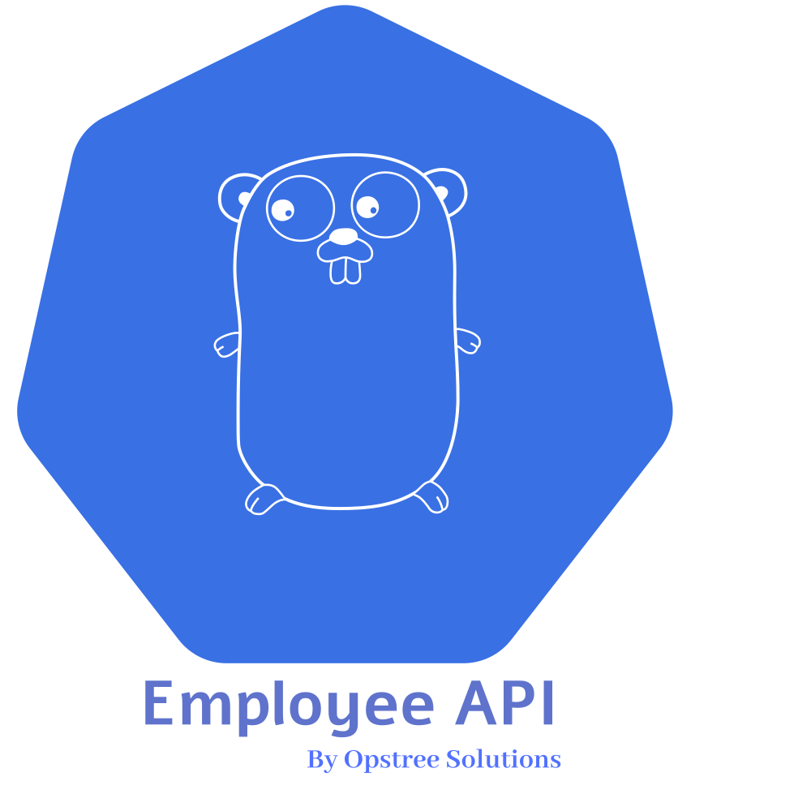

<p align="center">
  
</p>

----

# Employee API | POC Setup Without Docker

---

## Document Information

| Author | Created On | Version | L0 Reviewer | L1 Reviewer | L2 Reviewer |
| --- | --- | --- | --- | --- | --- |
| Ritu | 09/08/2026 | 1.1 | Liyakhat | Aman Raj | Sandeep Rawat/Ravindra |

---

# Table of Contents


1. [Introduction](#1-introduction)
2. [Prerequisites](#2-prerequisites)
3. [Clone Repository](#3-clone-repository)
4. [Installation and Setup](#4-installation-and-setup)
5. [Conclusion](#5-conclusion)
6. [Contact Information](#6-contact-information)
7. [References](#7-references)

---

# 1. Introduction

Employee API is a backend microservice used for managing employee-related information.
This document contains the rough steps followed during the Employee API POC setup on an AWS cloud server without using Docker.

---


# 2. Prerequisites

Before starting the Employee API setup, an AWS EC2 instance was created with **Ubuntu 24.04**.

## 2.1 AWS EC2 Instance

The following environment was used for the POC:

| Requirement      | Configuration        |
| ---------------- | -------------------- |
| **Cloud Platform**   | AWS                  |
| **Service**          | Amazon EC2           |
| **Operating System** | Ubuntu 24.04 LTS     |
| **Architecture**     | Linux AMD64 / x86_64 |
| **Application Port** | `8080`               |
| **ScyllaDB Port**    | `9042`               |
| **Redis Port**       | `6379`               |
| **SSH Port**         | `22`                 |

> **Note:** Port `8080` must be allowed in the EC2 Security Group if the Employee API needs to be accessed from outside the instance.

---

## 2.2 Required Tools and Services

The following tools/services are required for the setup:

| Tool / Service | Purpose                                   |
| -------------- | ----------------------------------------- |
| **AWS EC2**        | Provides the cloud server for the POC     |
| **Ubuntu 24.04**   | Operating system used on the EC2 instance |
| **Git**            | Clone the Employee API repository         |
| **Go**             | Build and run the Employee API            |
| **Make**           | Run project Makefile commands             |
| **ScyllaDB**       | Primary database for employee data        |
| **cqlsh**          | Connect and interact with ScyllaDB        |
| **Redis**          | Cache used by the Employee API            |
| **curl**           | Download tools and test API endpoints     |
| **wget**           | Download the Go package                   |
| **migrate**        | Run database migrations                   |
| **Swagger**        | View and test API documentation           |

---

# 3. Clone Repository

The Employee API source code was cloned from the OT-MICROSERVICES GitHub repository.

### Clone the repository

```bash
git clone https://github.com/OT-MICROSERVICES/employee-api.git
```


### Move into the project directory

```bash
cd employee-api
```

# 4. Installation and Setup

This section covers the installation, configuration, database migration, build, and verification of the Employee API on an Ubuntu EC2 instance.

## 4.1 ScyllaDB Setup

**Install ScyllaDB:**

```bash
curl -sSf get.scylladb.com/server | sudo bash
```


**Enable developer mode:**

```bash
sudo scylla_dev_mode_setup --developer-mode 1
```


**Enable, start and status check ScyllaDB:**

```bash
sudo systemctl enable scylla-server
sudo systemctl start scylla-server
```


```bash
sudo systemctl status scylla-server
```


**Connect to ScyllaDB:**

```bash
cqlsh 127.0.0.1 9042
```

Create the Employee API keyspace:

```sql
CREATE KEYSPACE employee_db WITH replication = {
    'class': 'NetworkTopologyStrategy',
    'replication_factor': 1
};
```


> **Purpose:** ScyllaDB is used as the primary database for storing Employee API data.

---

## 4.2 Redis Setup

**Install Redis:**

```bash
sudo apt install redis-server -y
```


**Enable, start and status check Redis:**


```bash
sudo systemctl start redis-server
sudo systemctl enable redis-server
```


```bash
sudo systemctl status redis-server
```


> **Purpose:** Redis is used as a caching layer for the Employee API.

---

## 4.3 Go Setup

**Download Go:**

```bash
wget https://dl.google.com/go/go1.20.14.linux-amd64.tar.gz
```


**Remove any existing Go installation:**

```bash
sudo rm -rf /usr/local/go
```


**Install Go:**

```bash
sudo tar -C /usr/local -xzf go1.20.14.linux-amd64.tar.gz
```


**Add Go to `PATH`:**

```bash
echo 'export PATH=$PATH:/usr/local/go/bin' >> ~/.bashrc
source ~/.bashrc
```


**Verify the installation:**

```bash
go version
```


> **Purpose:** Go is required to build and run the Employee API.

---

## 4.4 Employee API Configuration

Move to the application directory:

```bash
cd employee-api
```

**Edit the application configuration:**

```bash
Update the database address from the Docker IP(172.17.0.3) to:
127.0.0.1
```

```bash
cat config.yaml
```


> **Purpose:** The Employee API, ScyllaDB, and Redis are running on the same EC2 instance, so `localhost` is used instead of the Docker IP.

---

## 4.5 Migration Configuration

**Edit the migration configuration:**
```bash
Update the database address from the Docker IP(172.17.0.3) to:
127.0.0.1
```
```bash
cat migration.json
```


> **Purpose:** Allows database migrations to connect to the local ScyllaDB instance.

---

## 4.6 Swagger Configuration

**Edit `main.go`:**

Configure the Swagger documentation URL:

```go
url := ginSwagger.URL("/swagger/doc.json")
```

```bash
cat main.go
```


**Edit the Swagger documentation:**

Update the API host:

```go
Host: "43.204.108.146:8080",
```

```bash
cat docs/docs.go
```


> **Purpose:** Configures Swagger to generate and access the API documentation using the EC2 public IP and application port.

---

## 4.7 Database Migration

**Download the `migrate` tool:**

```bash
curl -L https://github.com/golang-migrate/migrate/releases/download/v4.15.2/migrate.linux-amd64.tar.gz | tar xvz
```


**Move it to the system path:**

```bash
sudo mv migrate /usr/local/bin/
```


Verify the installation:

```bash
migrate -version
```


**Install Make:**

```bash
sudo apt install make
```


**Run database migrations:**

```bash
make run-migrations
```


> **Purpose:** Applies the required database schema and migrations to ScyllaDB.

---

### 4.8 Build Employee API

**Update Go dependencies:**

```bash
go mod tidy
```


**Build the application:**

```bash
make build
```


> **Purpose:** Builds the Employee API executable after resolving the required Go dependencies.

---

## 4.9 Run Employee API

**Start the Employee API in the background:**

```bash
nohup ./employee-api > ~/employee.log 2>&1 &
```


**Verify that the application is listening on port `8080`:**

```bash
ss -tulnp | grep 8080
```

> **Purpose:** Runs the API in the background and verifies that it is listening on port `8080`.

---

## 4.10 API Verification

**Verify the Employee API health endpoint:**

```bash
curl http://localhost:8080/api/v1/employee/health/detail
```


> **Purpose:** Confirms that the Employee API is running successfully and responding to requests.

---

## 4.11 Swagger Verification


**Swagger UI:**

```text
http://43.204.108.146:8080/swagger/index.html
```


> **Note:** Ensure that port `8080` is allowed in the AWS EC2 Security Group for external Swagger access.

---

### Installation Flow

```text
AWS EC2 Ubuntu 24.04
        |
        v
Clone Employee API
        |
        v
Install ScyllaDB
        |
        v
Create employee_db
        |
        v
Install Redis
        |
        v
Install Go
        |
        v
Configure Employee API
        |
        v
Configure Swagger
        |
        v
Run Database Migration
        |
        v
Build Employee API
        |
        v
Run Employee API
        |
        v
Health Check
        |
        v
Swagger Verification
```


---


# 5. Conclusion

The Employee API was successfully set up as a POC on an AWS EC2 Ubuntu 24.04 instance without Docker.
ScyllaDB and Redis were configured as the required backend services. Go was installed, Docker-based application configuration was updated for local services, database migration was executed, and the Employee API was built and started on port `8080`.
The application was verified using the health endpoint and Swagger documentation.

---

# 6. Contact Information

| Name |         Email Address             |
| ---- | ----------------------------------|
| Ritu | ritu.dogra.snaatak@mygurukulam.co |

---

# 7. References

| Resource                | Link                                             |
| ----------------------- | ------------------------------------------------ |
| Employee API Repository | https://github.com/OT-MICROSERVICES/employee-api |
| Go Documentation        | https://go.dev/doc/                              |
| ScyllaDB Documentation  | https://docs.scylladb.com/                       |
| Swagger Documentation   | https://swagger.io/docs/                         |
| golang-migrate          | https://github.com/golang-migrate/migrate        |

