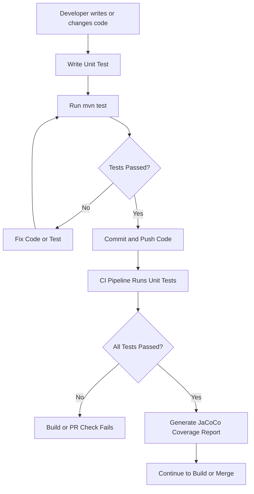

# Java Unit Testing

---

## Document Information

| Author | Created On | Version | L0 Reviewer | L1 Reviewer | L2 Reviewer |
| --- | --- | --- | --- | --- | --- |
| Ritu | 29/09/2026 | 1.0 | Liyakhat | Aman Raj | Sandeep Rawat/Ravindra |

---
## Table of Contents

1. [Introduction](#1-introduction)
2. [What is Unit Testing?](#2-what-is-unit-testing)
3. [Why Unit Testing Matters](#3-why-unit-testing-matters)
4. [Unit Testing Workflow](#4-unit-testing-workflow)
5. [Different Unit Testing Tools](#5-different-unit-testing-tools)
6. [Common Unit Testing Tools and Comparison](#6-common-unit-testing-tools-and-comparison)
7. [Advantages of Unit Testing](#7-advantages-of-unit-testing)
8. [Best Practices](#8-best-practices)
9. [Conclusion](#9-conclusion)
10. [Contact Information](#10-contact-information)
11. [References](#11-references)

---

## 1. Introduction

Unit testing is the practice of testing the smallest testable parts of a Java application, such as individual methods or classes.

In a Spring Boot microservice, unit testing mainly focuses on testing the business logic of **Service** and **Controller** classes without using real external dependencies such as databases, caches, or network services.

Unit tests are an important part of the testing process because they provide fast feedback whenever code is changed.

---

## 2. What is Unit Testing?

A **unit test** verifies whether a small and independent part of an application works as expected for a given input.

External dependencies are replaced with **mocks** or **stubs** so that the actual unit can be tested in isolation.

| Characteristic    | Description                                                          |
| ----------------- | -------------------------------------------------------------------- |
| **Isolated**      | Tests a specific method or class without real external dependencies. |
| **Fast**          | Usually completes in milliseconds.                                   |
| **Deterministic** | Produces the same result for the same input.                         |
| **Automated**     | Can be executed automatically using commands such as `mvn test`.     |
| **Repeatable**    | The same test can be executed multiple times without manual effort.  |

### Unit Test vs Integration Test vs E2E Test

| Test Type            | Scope                           | Speed     | External Dependencies              |
| -------------------- | ------------------------------- | --------- | ---------------------------------- |
| **Unit Test**        | Individual method/class         | Very fast | Mocked or replaced                 |
| **Integration Test** | Multiple application components | Medium    | Usually real/test dependencies     |
| **End-to-End Test**  | Complete application flow       | Slow      | Real or fully deployed environment |

---

## 3. Why Unit Testing Matters

Unit testing helps developers identify problems early and verify that individual parts of the application behave correctly.

| Without Unit Testing                             | With Unit Testing                              |
| ------------------------------------------------ | ---------------------------------------------- |
| Bugs may be discovered during QA or production.  | Bugs can be detected during development.       |
| Refactoring existing code can be risky.          | Tests provide a safety net during refactoring. |
| Expected behavior may not be clearly documented. | Tests demonstrate expected behavior.           |
| Manual verification is required repeatedly.      | Tests run automatically.                       |
| Feedback can take longer.                        | Developers receive fast feedback.              |

Unit testing therefore helps reduce debugging time and makes code changes safer.

---

## 4. Unit Testing Workflow

### Workflow Explanation

| Step                     | Description                                                             |
| ------------------------ | ----------------------------------------------------------------------- |
| **1. Write/Change Code** | Developer creates or modifies application logic.                        |
| **2. Write Unit Test**   | Tests are created for the required behavior.                            |
| **3. Run Tests**         | Tests are executed locally using `mvn test`.                            |
| **4. Check Result**      | If a test fails, the code or test is corrected.                         |
| **5. Commit & Push**     | After successful local testing, code is pushed to the repository.       |
| **6. CI Testing**        | CI automatically executes the unit tests.                               |
| **7. Coverage**          | JaCoCo can generate a code coverage report.                             |
| **8. Continue Pipeline** | If required checks pass, the pipeline can continue with further stages. |

---

## 5. Different Unit Testing Tools

| Tool                  | Category               | Purpose                                                                                    | Common Usage                       |
| --------------------- | ---------------------- | ------------------------------------------------------------------------------------------ | ---------------------------------- |
| **JUnit 5 (Jupiter)** | Testing Framework      | Creates and executes Java unit tests.                                                      | `@Test`, `@BeforeEach`, assertions |
| **Mockito**           | Mocking Framework      | Creates mock objects for dependencies.                                                     | `@Mock`, `when()`, `verify()`      |
| **AssertJ**           | Assertion Library      | Provides readable and fluent assertions.                                                   | `assertThat()`                     |
| **JaCoCo**            | Code Coverage          | Measures how much code is covered by tests.                                                | Line and branch coverage           |
| **Spring Boot Test**  | Spring Testing Support | Provides testing support for Spring Boot applications.                                     | `@SpringBootTest`, `@WebMvcTest`   |
| **TestNG**            | Testing Framework      | Alternative Java testing framework with features such as data-driven and parallel testing. | `@Test`, data providers            |

---

## 6. Common Unit Testing Tools and Comparison

| Tool                 | Main Purpose              | Best Used For                  | Learning Curve | Required?                           |
| -------------------- | ------------------------- | ------------------------------ | -------------- | ----------------------------------- |
| **JUnit 5**          | Writing and running tests | General Java unit testing      | Low            | Recommended                         |
| **Mockito**          | Mocking dependencies      | Testing classes in isolation   | Low            | Recommended for mocked dependencies |
| **AssertJ**          | Assertions                | Readable and fluent assertions | Low            | Optional                            |
| **JaCoCo**           | Code coverage             | Measuring tested code          | Low            | Optional but useful                 |
| **Spring Boot Test** | Spring testing            | Testing Spring components      | Medium         | Depends on test type                |
| **TestNG**           | Testing framework         | Data-driven and parallel tests | Medium         | Alternative to JUnit                |

---

## 7. Advantages of Unit Testing

| Advantage                | Description                                                               |
| ------------------------ | ------------------------------------------------------------------------- |
| **Early Bug Detection**  | Finds problems before they reach later testing stages.                    |
| **Safe Refactoring**     | Existing behavior can be verified after code changes.                     |
| **Fast Feedback**        | Tests execute quickly and provide immediate results.                      |
| **Easy Debugging**       | A failing test can point to a specific method or behavior.                |
| **Living Documentation** | Tests demonstrate the expected behavior of the code.                      |
| **CI/CD Integration**    | Unit tests can automatically run as part of the CI pipeline.              |
| **Improved Code Design** | Testable code generally encourages better separation of responsibilities. |

---

## 8. Best Practices

| #     | Best Practice                  | Description                                                                                                      |
| ----- | ------------------------------ | ---------------------------------------------------------------------------------------------------------------- |
| **1** | **Mock External Dependencies** | Mock databases, caches, HTTP clients, and other external dependencies to keep unit tests isolated.               |
| **2** | **Follow AAA Pattern**         | Structure each test using **Arrange → Act → Assert** for better readability.                                     |
| **3** | **Test Edge Cases**            | Test null values, empty values, boundary values, invalid inputs, and exceptions.                                 |
| **4** | **Use Clear Test Names**       | Use descriptive names such as `applyRaise_negativePercent_throwsException` to clearly explain the test scenario. |
| **5** | **Run Tests in CI**            | Run unit tests automatically in the CI pipeline for every relevant commit or pull request.                       |

---

## 9. Conclusion

Unit testing is an important part of Java application development. It helps developers verify individual methods and classes, detect bugs early, and make code changes safely.

For a Spring Boot microservice, **JUnit 5** can be used to write tests, **Mockito** to mock dependencies, and **JaCoCo** to measure code coverage. Running unit tests locally and automatically in the **CI pipeline** provides fast and continuous feedback.

A well-maintained unit test suite improves code quality, reduces debugging effort, and increases confidence when making future changes.

---
# 10. Contact Information

| Name |         Email Address             |
|-------|-----------------------------------
| Ritu | ritu.dogra.snaatak@mygurukulam.co— |

---

## 12. References

| **Source**                              | **Reference Link**                                                                                                                            |
| --------------------------------------- | --------------------------------------------------------------------------------------------------------------------------------------------- |
| **JUnit 5 – User Guide**                | [JUnit 5 Official Documentation](https://docs.junit.org/5.10.0/user-guide/index.html?utm_source=chatgpt.com)                                  |
| **Mockito – Official Documentation**    | [Mockito Official Documentation](https://site.mockito.org/?utm_source=chatgpt.com)                                                            |
| **Spring Boot – Testing Documentation** | [Spring Boot Testing Documentation](https://docs.spring.io/spring-boot/reference/testing/?utm_source=chatgpt.com)                             |
| **Spring Boot – Testing Applications**  | [Spring Boot Testing Applications](https://docs.spring.io/spring-boot/reference/testing/spring-boot-applications.html?utm_source=chatgpt.com) |
| **JaCoCo – Official Documentation**     | [JaCoCo Official Documentation](https://www.jacoco.org/jacoco/trunk/doc/?utm_source=chatgpt.com)                                              |
| **JaCoCo – Java Code Coverage Library** | [JaCoCo Official Website](https://www.jacoco.org/jacoco/?utm_source=chatgpt.com)                                                              |

