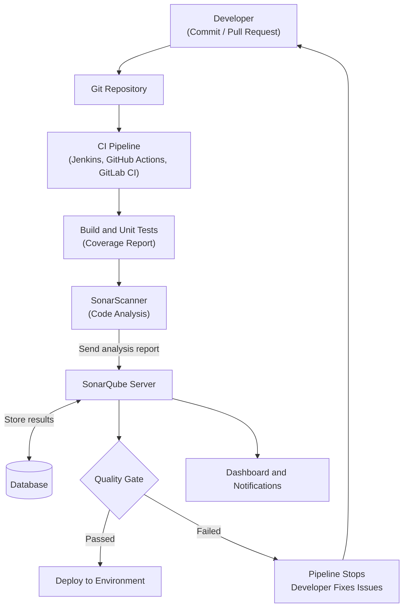

---

# SonarQube Documentation
---

## Document Information

| Author | Created On | Version | L0 Reviewer | L1 Reviewer | L2 Reviewer |
| --- | --- | --- | --- | --- | --- |
| Ritu | 24/09/2026 | 1.0 | Liyakhat | Aman Raj | Sandeep Rawat/Ravindra |

---
# Table of Contents

1. [Introduction](#1-introduction)
2. [What is SonarQube?](#2-what-is-sonarqube)
3. [Why SonarQube?](#3-why-sonarqube)
4. [Workflow Diagram](#4-workflow-diagram)
5. [Advantages](#5-advantages)
6. [Best Practices](#6-best-practices)
7. [Conclusion](#7-conclusion)
8. [Contact Information](#8-contact-information)
9. [References](#9-references)

---

# 1. Introduction

Modern development teams release software frequently, and every release carries the risk of introducing bugs, security vulnerabilities, and code that is difficult to maintain. Finding these problems late, close to production, is expensive and can affect users and the business.

SonarQube addresses this by automatically inspecting source code on every change and reporting quality and security problems while they are still easy to fix. This document explains what SonarQube is, why it is used, how it works within a CI/CD pipeline, its advantages, and the best practices for using it effectively.

---

# 2. What is SonarQube?

SonarQube is a code quality and security platform developed by SonarSource. It performs **continuous inspection** of source code using static analysis, which means it examines the code without running it. The results are displayed on a central web dashboard, and they can also be shown directly in pull requests and CI/CD pipelines.

SonarQube supports a wide range of programming languages, frameworks, and Infrastructure as Code (such as Terraform and Docker), and it integrates with tools such as Jenkins, GitHub Actions, GitLab CI/CD, Azure Pipelines, and Bitbucket Pipelines.

### What SonarQube Detects

- **Bugs:** coding errors that can cause incorrect behavior or failures at runtime.
- **Vulnerabilities:** security weaknesses that an attacker could exploit.
- **Security Hotspots:** security-sensitive code that needs a manual review to confirm it is safe.
- **Code Smells:** maintainability problems that make code harder to read, change, and extend.
- **Duplications:** repeated blocks of code that increase maintenance effort.
- **Test Coverage:** the percentage of code executed by automated tests, imported from coverage reports.

### Key Concepts

- **Quality Profile:** the set of rules used to analyze a specific language. Teams can use the default profile or customize it.
- **Quality Gate:** a set of pass or fail conditions that the code must meet, such as no new vulnerabilities and a minimum level of coverage on new code. If the conditions are not met, the gate fails and the pipeline can be stopped.
- **Clean as You Code:** an approach that focuses on keeping new and changed code clean, so quality improves steadily without having to fix all legacy code at once.
- **Technical Debt:** the estimated effort required to fix the maintainability issues in a project.

### Main Components

- **SonarQube Server:** receives analysis reports, applies the rules, calculates metrics, and hosts the web dashboard.
- **Database:** stores analysis results and configuration. PostgreSQL is recommended for production use.
- **SonarScanner:** runs in the build or CI pipeline, analyzes the code, and sends the report to the server.
- **IDE Extension (SonarQube for IDE):** gives developers instant feedback while they write code.

### Editions

- **Community Build:** free and open source, with core code quality and security analysis.
- **Developer Edition:** adds branch and pull request analysis, additional languages, and deeper security analysis.
- **Enterprise Edition:** adds portfolio management and reporting for large organizations.
- **Data Center Edition:** adds high availability and horizontal scalability for large deployments.

---

# 3. Why SonarQube?

Manual code reviews are valuable, but they are slow, inconsistent, and cannot reliably catch every bug or security issue. SonarQube automates this inspection and helps teams in the following ways:

- **Finds problems early:** code is analyzed on every commit and pull request, so bugs are caught during development instead of after release. Fixing an issue early costs far less than fixing it in production.
- **Improves security:** built-in security rules detect vulnerabilities and highlight security hotspots before the code is deployed.
- **Controls technical debt:** code smells and duplication are measured and tracked over time, preventing the codebase from becoming hard to maintain.
- **Standardizes coding practices:** shared quality profiles ensure that every team and project follows the same rules.
- **Provides objective feedback:** automated analysis gives consistent results and reduces subjective disagreements during code review.
- **Gives visibility:** a central dashboard shows the health of every project in terms of quality, security, coverage, and duplication.
- **Blocks poor code:** Quality Gates prevent code that does not meet the agreed standards from being merged or released.

---

# 4. Workflow Diagram

The diagram below shows how SonarQube fits into a CI/CD pipeline.

### Workflow Explanation

1. **Commit:** the developer pushes code or raises a pull request in the Git repository.
2. **CI trigger:** the CI pipeline starts automatically and builds the project.
3. **Build and tests:** unit tests are executed and a code coverage report is generated.
4. **Code analysis:** SonarScanner analyzes the source code together with the coverage report.
5. **Report processing:** the analysis report is sent to SonarQube Server, which applies the quality profile rules and stores the results in the database.
6. **Quality Gate evaluation:** SonarQube checks the results against the Quality Gate conditions and returns either Passed or Failed.
7. **Feedback:** the results appear on the dashboard and in the pull request, and the team receives notifications.
8. **Outcome:** if the Quality Gate passes, the pipeline continues to deployment. If it fails, the pipeline stops, the developer fixes the reported issues, and the code is analyzed again.

---

# 5. Advantages

- **Early issue detection:** bugs and vulnerabilities are identified during development, when they are cheapest to fix.
- **Better code quality:** continuous inspection keeps the code clean, readable, and maintainable.
- **Stronger security:** vulnerabilities and security hotspots are flagged before code reaches production.
- **Quality Gate enforcement:** low-quality or insecure code is blocked automatically.
- **Wide language support:** many popular languages, frameworks, and Infrastructure as Code files are supported.
- **Easy CI/CD integration:** it works with the most widely used CI/CD and DevOps platforms.
- **Centralized visibility:** one dashboard shows quality metrics and trends across all projects.
- **Faster code reviews:** reviewers can focus on design and logic because routine issues are already reported automatically.
- **Free edition available:** the Community Build is free and open source, so any team can start using it.

---

# 6. Best Practices

- **Enforce the Quality Gate:** fail the pipeline when the Quality Gate fails so poor code cannot move forward.
- **Follow Clean as You Code:** apply strict conditions to new code and reduce legacy issues gradually.
- **Analyze every pull request:** show the Quality Gate result in the pull request for early feedback.
- **Use PostgreSQL in production:** the embedded database is only for evaluation. Back up the database and upgrade regularly.
- **Keep tokens secure:** store SonarQube tokens in the CI secrets manager, never in the repository.
- **Standardize rules:** use shared quality profiles and role-based access control across teams.
- **Report test coverage:** import coverage reports and fix Blocker, Critical, and vulnerability issues first.

---

# 7. Conclusion

SonarQube helps teams deliver clean, secure, and maintainable code by automatically analyzing every change and enforcing Quality Gates in the CI/CD pipeline. It detects bugs and vulnerabilities early, reduces technical debt, and gives clear visibility into the health of the codebase. By following the best practices described in this document, teams can improve software quality, reduce the risk of production issues, and release with greater confidence.

---

# 8. Contact Information

| Name |         Email Address             |
| ---- | ----------------------------------|
| Ritu | ritu.dogra.snaatak@mygurukulam.co |

---

# 9. References

| **Reference**                                                             | **Purpose**                              |
| ------------------------------------------------------------------------- | ---------------------------------------- |
| [SonarQube Documentation](https://docs.sonarsource.com/sonarqube-server/) | Official SonarQube Server documentation  |
| [SonarQube Product Page](https://www.sonarsource.com/products/sonarqube/)  | Product overview and editions            |
| [SonarQube GitHub Repository](https://github.com/SonarSource/sonarqube)   | Source code and project information      |
